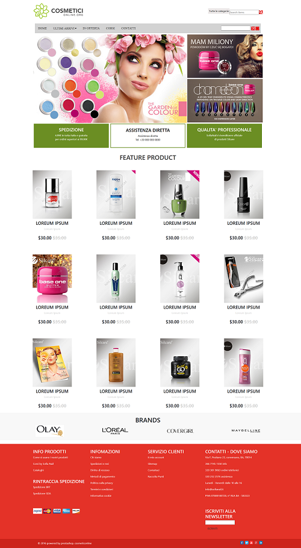

# Cosmetic Online Landing Page

This project is a **cosmetic store landing page** designed using **HTML**, **CSS**, and **JavaScript**. It showcases a modern and professional layout for online cosmetic shops, featuring sections for product highlights, brand promotions, and customer services.

---

## Features

1. **Header Section**

   - Navigation bar with links: _Home, New Arrivals, Offers, Courses, Contact_.
   - A search bar for easy product lookup.

2. **Hero Section**

   - An attractive promotional banner with visuals for cosmetic products and services.

3. **Featured Products**

   - Display of products with pricing, discounts, and eye-catching images.
   - Uniform layout for product listings.

4. **Brand Section**

   - Logos of prominent cosmetic brands (e.g., Olay, L'Oréal, CoverGirl, Maybelline).

5. **Footer Section**
   - Information on:
     - Product usage guides.
     - Company details and policies.
     - Customer support contact and social media links.
   - Newsletter subscription form.

---

## How to Use

1. Clone or download the repository files to your local machine.
2. Open the `index.html` file in your browser to view the landing page.

---

## Technologies Used

- **HTML**: For the structure of the page.
- **CSS**: For styling and layout design.
- **JavaScript**: For interactive elements (if applicable).

---

## Folder Structure

```
/css         # Stylesheets
/js          # JavaScript files (if any interactive features exist)
/images      # Image assets for the page
index.html   # Main HTML file
```

---

## Future Enhancements

- Integrate a backend for product management and cart functionality.
- Add responsiveness for mobile devices.
- Include interactive animations for a better user experience.

---

## License

This project is open-source and free to use. Modify and enhance as per your requirements!
